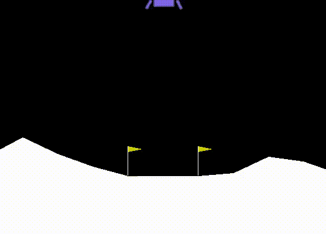

# LunarLander
---
<center></center>

<center>image credit by [Gym (openai.com)](https://gym.openai.com/envs/LunarLanderContinuous-v2/)</center>

## You will learn to solve problem using genetic algorithm (GA).
LunarLander is a game in Open AI Gym. In this game, the task is to navigate the lander to the landing pad. By precisely controlling the lander's main engine and side engines, which produce the vertical and horizontal thrust, the lander can land on pad safely.

A safety landing on the landing pad gets a positive reward. A safety landing outside the landing pad gets no reward. Crashing the lander yields a huge negative reward. In addition, the total fuel consumption is converted into a negative reward. In other words, your lander is expected to perform a safe, precise, and fuel-efficient maneuver to maximize the reward received.

### Problem Description
In this assignment, you are asked to optimize the control policy of the lunar lander with genetic algorithm (GA). The lunar lander continuously observes its status and the environment and pilots itself according to the control policy you provided. We have implemented a GA and testing framework for you. Your task is to design and implement the evolutionary operators and tune the parameters for GA so that GA works effectively and efficiently.

** - observes **

&emsp;&emsp; For every time stamp, the lunar lander receives an observation vector which contains the following dimensions:

&emsp;&emsp; *x position 

&emsp;&emsp; * y position

&emsp;&emsp; * x velocity 

&emsp;&emsp; * y velocity

&emsp;&emsp; * tilt angle

&emsp;&emsp; * angular velocity

&emsp;&emsp; * whether the right leg attaches to the ground (unused)


- ** action **
&emsp;&emsp; The lunar land allows us to control the main engine and side engines. An action therefore consists of 2 dimensions, i.e., 
&emsp;&emsp; * main engine power
&emsp;&emsp; * side engine power
&emsp;&emsp; The main engine power and side engine power each consists of a real value in [−1, 1], indicating the thrust of the engines. For the main engine power, a value < 0 stops the engine to produce thrust. For the side engine power, a negative value and a positive value refer to the left and right engine thrust, respectively.


- ** control policy **
&emsp;&emsp; To establish a complete mapping between the observation and action spaces, a control policy must encode an action for each observation case. In other words, a control policy will be an 8192-dimensional vector (4^6 × 2), where each value is in [−1, 1]. You need to use GA to optimize the 8,192 thrust values for the lunar lander to gain as high reward as possible. 


## System Requirement 
** window 10
```
pip install gym
pip install box2d
pip install pyglet
```

** Mac OS
```
pip3 install gym[all]
pip3 install box2d
```

---
Reference: [LunarLand GA](https://sites.google.com/gapp.nthu.edu.tw/lunarlander-ga)


<size=1> This site is composed by Heng-An Chen, Yi-Reui Chen, Yu-Wei Wen . Last update 2020.11.04 </font>
<size=1> Computational Intelligence Lab (CI Lab), Dept. of PME, NTHU, Taiwan. </font>
